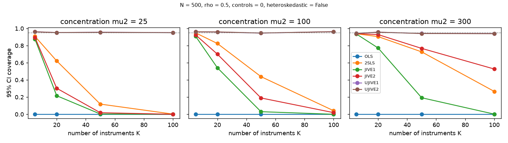
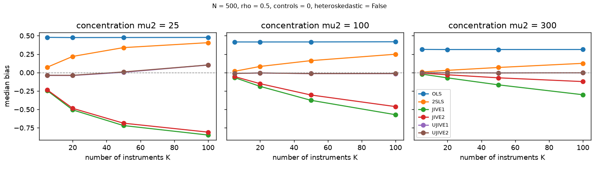

# Monte Carlo study

Does each estimator do what it is supposed to with many, possibly weak, instruments? The checks against R and Stata in
[`validation/`](../validation/) show that our estimators compute the same numbers as other software. They do not show that
those numbers are *good*. This study measures bias and confidence-interval coverage against a known truth.

**Status: run** (2,000 replications per cell; the full grid takes about 40 seconds on 6 cores). The design and the hypotheses below were fixed before any results existed; the results and how the hypotheses fared are in the last section.

## Design

The data generating process (`simulate` in `monte_carlo.py`), for `n` observations, `k` instruments and `G` controls:

```
x = 0.5 + c * (z_1 + ... + z_k) + 0.5 * (w_1 + ... + w_G) + v
y = 1 + 1 * x                   + 0.5 * (w_1 + ... + w_G) + eps
```

`z` and `w` are standard normal; `(eps, v)` have unit variances and correlation `rho`; the true coefficient on `x` is 1.
All instruments have the same coefficient `c = sqrt(mu2 / (n k))`, so the **concentration parameter** is `mu2`, and the
expected first-stage F-statistic is about `1 + mu2 / k`. Holding `mu2` fixed while `k` grows is the classic
many-instruments design: the same total information is spread over more and more instruments, so 2SLS overfits.

| Axis | `full` grid | `quick` grid |
|---|---|---|
| sample size `n` | 500 | 200 |
| instruments `k` | 5, 20, 50, 100 | 5, 20 |
| concentration `mu2` | 25, 100, 300 | 25, 100 |
| error correlation `rho` | 0.5 | 0.5 |
| controls | 0, 2 | 0, 2 |
| heteroskedastic error | no (`--hetero no yes` adds yes) | no |

The observed first-stage F therefore ranges from about 1.25 (`k = 100`, `mu2 = 25`) to about 61 (`k = 5`, `mu2 = 300`).
All axes can be overridden on the command line; see `python simulation/monte_carlo.py --help`.

**Estimators:** OLS, 2SLS, `JIVE1`, `JIVE2`, `UJIVE1`, `UJIVE2`. OLS and 2SLS use the same robust (HC0) sandwich and
t interval as the jackknife estimators, so differences come from the point estimates.

**Reported per cell and estimator** (coefficient on `x`): median and mean bias, median absolute error (robust to heavy
tails, which the jackknife estimators can have), RMSE, coverage of the 95% interval, median interval width, the ratio of the
median reported standard error to the IQR-based standard deviation of the estimates, and how often the estimator raised an
error.

## Running it

```
python simulation/monte_carlo.py --dry-run                     # prints the design and the number of model fits; simulates nothing
python simulation/monte_carlo.py --grid quick --reps 50        # small trial run: checks the pipeline and times your machine
python simulation/monte_carlo.py --grid full --reps 2000 --workers 4
python simulation/report.py                                    # tables (report.md) and figures (needs matplotlib)
```

Runs are reproducible: replication `r` of cell `i` is seeded by `(seed, i, r)`, so results do not depend on the number of
workers. Finished cells are saved as they complete and skipped on re-running, so an interrupted run resumes. Output goes to
`simulation/results/` (git-ignored). Timing: the full grid (24 cells x 2,000 replications x 6 estimators) took 38 seconds with 6 workers on a 10-core Mac, so the cost
is small. The cost of a model fit grows with `n (k + G)^2`.

## What we expect to see (written before running)

These are predictions, several of them uncertain, and any of them can turn out wrong.

1. **OLS** is biased upward by about `rho / (1 + mu2 / n)` (roughly 0.3 to 0.5) in every cell, and its coverage is far below 95%. This is a check of the design, not a finding.
2. **2SLS** median bias grows with `k` and shrinks with `mu2`, roughly like `rho * k / (k + mu2)` (a Nagar-type approximation, for `k` above 2). It should be near OLS's bias in the weakest cells and small in the strongest. Its coverage should fall as bias grows relative to the standard error.
3. **`UJIVE1` and `UJIVE2`** (the Angrist-Imbens-Krueger JIVE in IV form) should have median bias near zero wherever the first stage is not hopelessly weak, at the price of larger spread than 2SLS (higher median absolute error in the weak cells) and occasional extreme estimates. Their intervals should cover close to 95% in the moderate and strong cells and under-cover in the weakest.
4. **`JIVE1` and `JIVE2`** (regress `Y` on the leave-one-out fitted values) are the open question. No paper we know of defines them. The leave-one-out fitted value is a noisy version of the true first-stage fit, and regressing on a noisy regressor biases the coefficient toward zero. So we expect a **downward** bias (below 1), growing with `k` at fixed `mu2`. If instead they behave like `UJIVE1`, the regression form is fine and we were wrong. Their standard errors are also untested.
5. **`UJIVE1` vs `UJIVE2`** should be close (they differ only by a different denominator, `1 - h` against `1 - 1/N`).
6. **Standard errors:** the ratio of reported to actual spread should be near 1 for the estimators with good coverage and well below 1 where coverage fails.
7. **Failures:** errors (a leverage of 1, and so on) should be rare with continuous instruments.

## Limits

One sample size, normal errors, equal-strength instruments, and no fixed effects, clustering or judge-style dummy instruments.
It does not include Kolesár's UJIVE, which we do not implement. Results are for the coefficient on the endogenous variable only.

## Results

Committed outputs: [`results/`](results/) (homoskedastic errors) and [`results_hetero/`](results_hetero/) (heteroskedastic errors),
each with `summary.csv`, `report.md` (all tables) and figures. Reproduce with
`python simulation/monte_carlo.py --grid full --reps 2000 --workers 6 [--hetero yes --out simulation/results_hetero]` and the seed
`20260924`. With 2,000 replications a coverage estimate has a Monte Carlo standard error of about 0.005. No estimator failed in any
of the 48 cells. The observed first-stage F matched the design (`1 + mu2 / k`), and OLS's bias matched `rho / (1 + mu2 / n)`, so the
design behaves as intended.




### What we found

- **`UJIVE1` and `UJIVE2` work.** Their median bias is close to zero (largest in absolute value 0.09) except in the single weakest cell
  (`k = 100`, `mu2 = 25`, first-stage F about 1.2), where it is +0.06 to +0.10. **Their 95% intervals cover between 0.938 and 0.975 in every
  one of the 24 homoskedastic cells**, and between 0.943 and 0.977 with heteroskedastic errors, so the robust standard errors do their job.
  In the weakest cells they achieve this by being very wide (about 2.1 across at `k = 100`, `mu2 = 25`, against 0.31 for 2SLS): they are
  honest about how little the data say. `UJIVE1` and `UJIVE2` are practically identical.
- **2SLS shows the many-instruments problem.** Its median bias grows with `k` and falls with `mu2`, and matches `rho * k / (k + mu2)`
  closely (predicted 0.40, observed 0.406 at `k = 100`, `mu2 = 25`). Its standard errors are the right size (ratio to actual spread
  about 1), but its intervals are centred in the wrong place: coverage falls to 0.002 at `k = 100`, `mu2 = 25`, and to 0.27 even at `mu2 = 300`.
- **`JIVE1` and `JIVE2` (regress `Y` on the leave-one-out fit) are biased toward zero and their standard errors are too small.** The
  median bias reaches -0.88 (`JIVE1`) and -0.85 (`JIVE2`) and grows with `k` at fixed `mu2`; the reported standard errors are only about 70-80%
  of the true spread in the weakest many-instrument cells (ratio 0.68-0.99 overall); `JIVE1`'s coverage is 0.000-0.002 at `k = 100` for every strength
  (`JIVE2`'s is 0.00-0.02, and 0.49-0.53 at `mu2 = 300`). `JIVE2` is somewhat better than
  `JIVE1` and recovers with strong instruments, but both are clearly worse than 2SLS in the weaker cells. They are only acceptable with
  few instruments and a strong first stage (`k = 5`, `mu2 = 300`: median bias -0.01 to -0.03, coverage 0.92-0.94). **We recommend `UJIVE1` / `UJIVE2`, not `JIVE1` /
  `JIVE2`, when there are many instruments.**

### How the predictions fared

| # | Prediction | Result |
|---|---|---|
| 1 | OLS biased by about `rho / (1 + mu2 / n)`; coverage far below 95% | **Confirmed** (0.476 predicted and observed at `mu2 = 25`; coverage 0.000 everywhere) |
| 2 | 2SLS bias grows with `k`, falls with `mu2`, about `rho k / (k + mu2)`; coverage falls | **Confirmed**, quantitatively |
| 3 | `UJIVE` median-unbiased, larger spread than 2SLS in weak cells, under-covers in the weakest | **Partly wrong.** Median-unbiased except the weakest cell (confirmed). Spread larger than 2SLS only at `k = 5`, `mu2 = 25`; elsewhere similar or better (`k = 100`, `mu2 = 100`: median error 0.11 against 0.25). Coverage did **not** fail in the weakest cells: it stayed near 95% by using very wide intervals. |
| 4 | `JIVE1` / `JIVE2` biased downward, growing with `k` | **Confirmed**, and larger than expected; their standard errors are also too small |
| 5 | `UJIVE1` and `UJIVE2` close | **Confirmed** (coverage differs by at most 0.002 and median absolute error by at most 0.007) |
| 6 | Reported / actual spread near 1 where coverage is good and well below 1 where it fails | **Partly wrong.** True for `JIVE1` / `JIVE2` (0.7-0.8) but 2SLS has ratio about 1 while failing (its failure is bias, not standard error). `UJIVE`: 0.88-1.05, slightly small (0.88-0.92) in the weakest, small-`k` cells, yet coverage is fine. |
| 7 | Errors rare | **Confirmed** (none in 576,000 fits across both runs) |

The mechanism behind the `JIVE1` / `JIVE2` bias is our explanation, not something this study tested: the leave-one-out fitted value is a
noisy version of the true first-stage fit, and regressing `Y` on a noisy regressor attenuates the coefficient.

### Caveats

One sample size (500), normal errors, equal-strength instruments, error correlation 0.5, and no fixed effects, clustering or
judge-style dummy instruments; results may differ elsewhere. Kolesár's UJIVE is not included because we do not implement it.
The comparison used one true value (1) and one seed; more `n`, `rho` and instrument-strength patterns would show how general this is.
